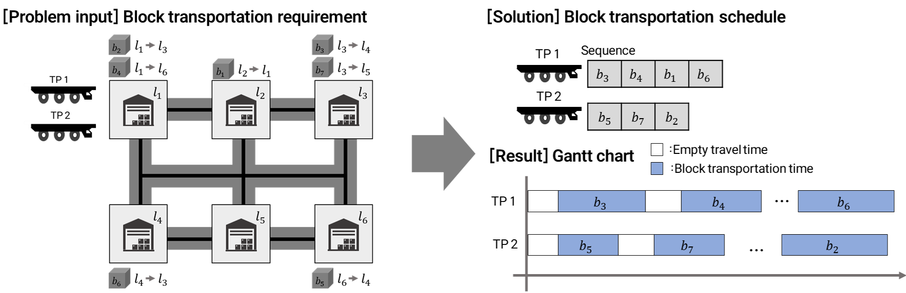

# 2024_BTSP_RL

|                 Developer                |               Developer               |                
| :--------------------------------------: | :-----------------------------------: | 
| [Seung Woo Han](https://github.com/SeungwooHH11) | [Seung-heon Oh](https://github.com/hyunjinei) |
|         🧑‍💻 AI-Development               |       🧑‍💻 AI-Development               |                
 

## Project Overview
- **Project**
    - Block transportation scheduling algorithm with graph reinforcement learning
- **Superviser**
    - Prof. Jong Hun Woo (SNU, KOREA)
- **Data provider**
    - HD Korea Shipbuilding & Offshore Engineering (KSOE)
- **Paper**
    - [Crystal Graph Convolutional Neural Network-Based Reinforcement Learning for Adaptive Shipyard Block Transportation Scheduling](https://papers.ssrn.com/sol3/papers.cfm?abstract_id=5183857)
    - EAAI (revision being proceeding)
 

## Project Introduction
We develop a block transportation scheduling algorithm for shipyards 
 
The Block Transportation Scheduling Problem (BTSP) is a key logistics challenge in shipyards.  
Our goal is to develop a **scalable scheduling algorithm capable of dynamic decision-making**.  
#Problem overview

 

## Main Function

### 1️⃣ Overall framework

 

### 2️⃣ Markov decision process

#### 2.1 State
- a compound state representation composed of a heterogeneous graph and auxiliary matrix
    - **heterogeneous graph**: a modified disjunctive graph for FJSP
        - nodes representing quay walls and operations
        - edges representing low preference / high preference / precedence constraints
    - **auxiliary matrix**: a matrix for predicting the effects of the scheduling actions

#### 2.2 Action
- a combination of the vessel and quay-wall (machine assignment and job sequencing)
    - **candidate vessels**
        - newly launched vessels from the docks
        - vessels returning from sea trials
        - vessels waiting at sea owing to the shortage of quay-walls
        - vessels that need to be reallocated due to interruption
    - **candidate quay walls**
        - empty quay walls
        - occupied quay walls with preemption allowed

#### 2.3 Reward
- minimization of the total cost in the post-stage outfitting process
- a sum of three cost-related rewards
    - **penalty cost**: the penalty cost for the delay in the delivery of vessels
    - **moving cost**: the cost of moving the vessels
    - **loss cost**: the additional processing cost

 

### 3️⃣ DES-based learning environment
- DES model of the post-stage outfitting process in shipyards
- state transition that takes the action of the agent as the input and calculates the next state and reward.

 

### 4️⃣ Scheduling agent with PPO algorithm
#### 4.1 Network Structure

- **Representation module**
    - Two types of latent representation are extracted from the heterogeneous graphs and auxiliary matrix, respectively
    - For heterogeneous graphs, the embedding vectors of nodes are generated using the relational information between nodes
    - For an auxiliary matrix, the embedding vectors for combinations of quay-walls and vessels are generated using the MLP layers 
- **Aggregation module**
    - Input vectors for the output model are generated based on the embedding vectors from the representation module
- **Output module**
    - The actor layers calculate the probability distribution over actions $\pi_{\theta} (\cdot|s_t)$
    - The critic layers calculate a approximate state-value function $V_{\pi_{\theta}} (s_t)$, respectively

#### 4.2 Reinforcement Learning Algorithm
- **PPO(proximal policy optimization)**
    - Policy-based reinforcement learning algorithm
